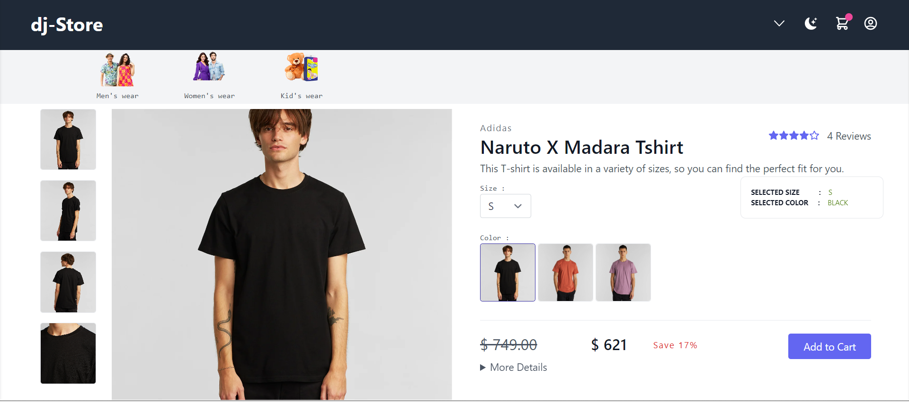

# Django Ecommerce - https://sumit1196.pythonanywhere.com

This repository contains a fully-featured ecommerce website built with Django, Python, HTML, CSS, and Tailwind CSS. The website includes various functionalities commonly found in an ecommerce platform, such as:

## Table of Contents

- [Demo](#demo)
- [Features](#features)
- [Technologies Used](#technologies-used)
- [Setup](#setup)
- [Usage](#usage)
- [Contributing](#contributing)
- [License](#license)

## Demo

You can see a live demo of the application [here](https://sumit1196.pythonanywhere.com).


## Features

- **Home Page**: A visually appealing landing page that showcases featured products, promotions, and categories.


- **Product Listing Page**: Displays a list of products with various filtering options, such as category, price range, color, etc.


- **Product Details Page**: Provides detailed information about a specific product, including multiple color and size options.



- **Shopping Cart**: Allows users to add products to their shopping cart and view/edit the cart contents.


- **Checkout**: Enables users to complete their purchases securely using the Instamojo payment gateway integration.


- **Order Tracking**: Provides functionality for customers to track their orders and view their order history.


- **User Authentication**: Allows users to create accounts, log in, and manage their personal information.


- **Admin Dashboard**: Offers an intuitive administration interface for managing products, orders, customers, and other site settings.


## Technologies Used

The following technologies are used in this project:

- Python
- Django
- HTML
- CSS
- Tailwind CSS
- Instamojo Payment Gateway Integration

## Installation

To install and run the project locally, follow these steps:

1. Clone the repository:

   ```bash
   git clone https://github.com/sumit-singh1196/DJ-Store.git

2. Change into the project directory:

   ```bash
   cd DJ-Store

3. Create and activate a virtual environment:

   ```bash
   python -m venv env
   source env/bin/activate  # For Linux/Mac
   env\Scripts\activate  # For Windows

4. Install the required dependencies:

   ```bash
   pip install -r requirements.txt

5. Set up the database:

   ```bash
   python manage.py migrate

6. Start the development server:

   ```bash
   python manage.py runserver

7. Open your browser and visit http://localhost:8000 to view the website.


## Configuration

- To configure the Instamojo payment gateway integration, update the following settings in the settings.py file:
    API_KEY = 'your-instamojo-api-key'
    AUTH_TOKEN = 'your-instamojo-auth-token'

- Replace 'your-instamojo-api-key' and 'your-instamojo-auth-token' with your actual Instamojo API credentials.


## Contributing
- Contributions are welcome! If you'd like to contribute to this project, please follow these steps:

Fork the repository.
- Create a new branch.
- Make your changes and commit them.
- Push your changes to your forked repository.
- Submit a pull request.
- Please ensure your pull request follows the project's coding guidelines and includes relevant tests if applicable.

## License
- This project is licensed under the MIT License.
